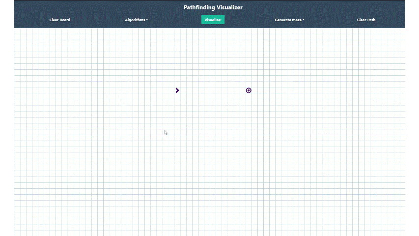

# Pathfinding Visualizer - [Live demo](https://punit-koujalgi.github.io/PathFinder/)

A React-based interactive application that visualizes various pathfinding algorithms and maze generation techniques. Watch in real-time as different algorithms explore the grid to find the shortest path between a start and end point.

## Demo

### How to Use


### Maze Generation


## Features

- **Interactive Grid**: Click and drag to create walls, move start/end points
- **Real-time Visualization**: Watch algorithms explore the grid step-by-step
- **Multiple Algorithms**: Compare different pathfinding strategies
- **Maze Generation**: Automatically generate mazes with various patterns
- **Responsive Design**: Adapts to your screen size

## Pathfinding Algorithms

### Dijkstra's Algorithm
Dijkstra's algorithm is a weighted pathfinding algorithm that guarantees the shortest path. It explores nodes in all directions equally, making it reliable but potentially slower than informed search algorithms. This algorithm works by maintaining a priority queue of nodes and always exploring the node with the smallest distance from the start.

### A* Search Algorithm
A* (A-star) is an informed search algorithm that uses heuristics to guide its search. It combines the actual distance from the start (like Dijkstra) with an estimated distance to the goal (heuristic). This makes it faster than Dijkstra while still guaranteeing the shortest path. The algorithm uses Manhattan distance as its heuristic function.

### Best-First Search (Greedy)
Best-First Search is a greedy algorithm that focuses primarily on the heuristic distance to the target. Unlike A*, it doesn't consider the actual distance traveled from the start, making it faster but not guaranteed to find the shortest path. It's useful when you want a quick solution rather than an optimal one.

### Breadth-First Search (BFS)
BFS is an unweighted pathfinding algorithm that explores nodes level by level. It guarantees the shortest path in terms of number of nodes traversed. The algorithm uses a queue (FIFO) to explore all neighbors at the current depth before moving to the next level, ensuring it finds the shortest path in unweighted graphs.

### Depth-First Search (DFS)
DFS is an unweighted algorithm that explores as far as possible along each branch before backtracking. It uses a stack (LIFO) approach and doesn't guarantee the shortest path. While not optimal for pathfinding, it's useful for maze solving and exploring all possible paths.

## Maze Generation Algorithms

### Random Maze
Creates a maze by randomly selecting grid cells and converting them to walls with a 25% probability. This generates a simple, chaotic maze pattern that's quick to create but may not always result in interesting or challenging mazes. The randomness ensures each generation is unique.

### Recursive Division Maze
A more sophisticated maze generation technique that recursively divides the grid into smaller chambers. It starts with an empty grid, adds walls to divide the space, and leaves random gaps for passages. This creates more structured mazes with a recursive pattern, resulting in challenging and visually interesting layouts.

### Staircase Maze
Generates a diagonal staircase pattern across the grid. The algorithm creates a zigzag wall pattern that alternates between moving up and down as it progresses across the grid. This creates a distinctive staircase-like maze that provides a unique challenge for pathfinding algorithms.

## Installation

1. Clone the repository:
```bash
git clone https://github.com/Punit-Koujalgi/PathFinder.git
cd PathFinder
```

2. Install dependencies:
```bash
npm install
```

3. Start the development server:
```bash
npm start
```

4. Open [http://localhost:3000](http://localhost:3000) to view it in your browser.

## Usage

1. **Select an Algorithm**: Choose a pathfinding algorithm from the dropdown menu
2. **Create Walls**: Click and drag on the grid to create walls (obstacles)
3. **Move Start/End Points**: Drag the start (green) and end (red) nodes to reposition them
4. **Generate Maze**: Select a maze generation algorithm to automatically create walls
5. **Visualize**: Click the visualize button to watch the algorithm in action
6. **Clear**: Reset the grid to try different configurations

## Technologies Used

- React 17
- Redux Toolkit (State Management)
- React Bootstrap
- JavaScript (ES6+)
- CSS3

## Scripts

- `npm start` - Run the development server
- `npm build` - Build for production
- `npm test` - Run tests
- `npm run deploy` - Deploy to GitHub Pages

## License

This project is open source and available under the MIT License.

## Acknowledgments

- Inspired by the classic pathfinding visualizers and the need to understand how different algorithms work
- Built with React and modern web technologies for smooth, interactive visualizations
